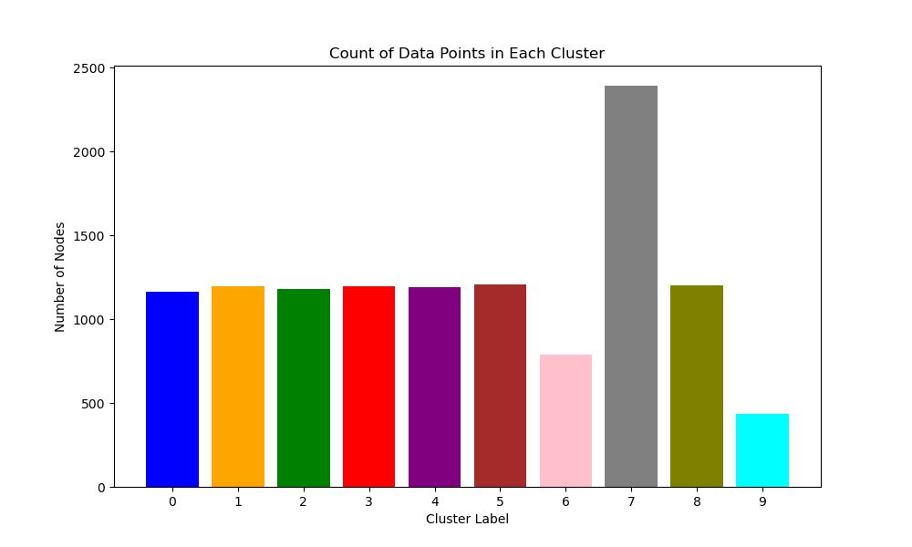

# Data Mining Project

**Authors:**  
- Aditya Suryawanshi (210150004)  
- Harsh Raj (210150011)

## Introduction

In this project, we aim to apply clustering techniques on a dataset to identify underlying patterns. We then use a neural network model to predict cluster labels for new data points. The primary objectives are:

- **Task 1:** Cluster the first 10,952 data samples into 10 clusters using non-neural network methods.
- **Task 2:** Train a neural network using the clustered data.
- **Task 3:** Predict cluster labels for 1,000 samples using the trained neural network.

## Methodology

The methodology consists of the following steps:

1. **Spectral Embedding with Normalization:** The adjacency matrix is used to compute spectral embeddings. These are normalized for consistency.
   
2. **PCA Dimensionality Reduction:** Reduces the dimensionality of the data to 50 components while preserving key features.

   

3. **K-Means Clustering:** The K-Means algorithm clusters the dataset into 10 clusters based on the features.
   
   

4. **Neural Network Classification:** A neural network is trained using the cluster labels and feature matrix to predict labels for new data points.
   
   

## Model Description

The neural network model used in this project is a simple feedforward neural network. It has:

- **Input Layer:** Size is determined by the dimensionality of the feature matrix.
- **Hidden Layer:** 128 neurons with ReLU activation.
- **Output Layer:** 10 neurons for cluster classification.

The model is trained using **cross-entropy loss** and optimized using **Adam**. We also implement a learning rate scheduler for better convergence.

## Failed Attempts

Several alternative techniques were tested but failed to yield satisfactory results:

- **t-SNE** and **LLE** for dimensionality reduction were inefficient due to the dense graph structure.
- **DBSCAN** clustering was unsuccessful due to the high-dimensional nature of the data.
- **Ratio Cut** was less effective compared to normalized spectral cuts.

We also encountered overfitting during neural network training, attributed to poor clustering quality in the initial stage.

## Analysis

We analyzed the distribution of nodes across different clusters after clustering the data:

## Source Code

The source code for the project can be found on [Google Colab](https://colab.research.google.com/drive/1qKCwZxZuoZx86NGAd5eos55Sb_EreYaf?usp=sharing).

---

### Project Structure:

- **/images** : Directory containing images used in the README.
- **code/** : Contains Python scripts for clustering, feature extraction, and model training.

